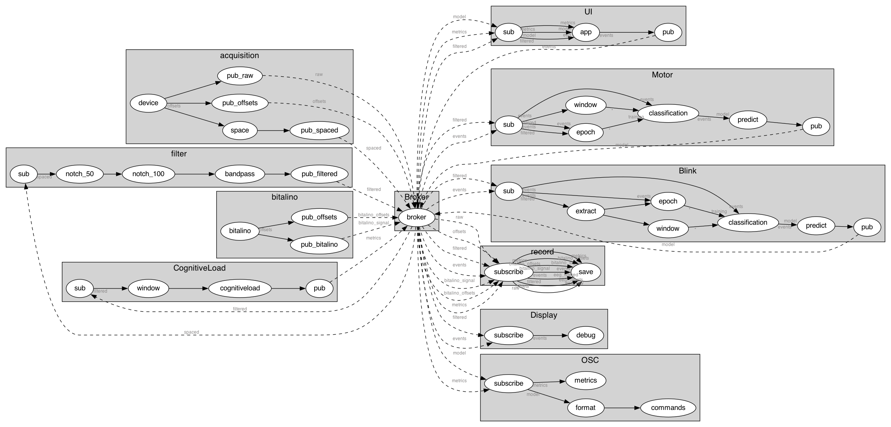

# BCI control application

This is a working prototype of a BCI control application. It uses two motor imagery commands (left and right hand) and one muscular command (blink) to move around the interface and execute actions.

In this version, two separate machine-learning models are computed after a calibration session. The interface is a grid, where each cell is associated with a given action. The number of cells is arbitrary. At the beginning, the center cell is highlighted. The user can move to the left or right cell by mentally performing a movement with her left or right hand. A single blink changes the orientation: the left hand now allows to move one cell down, and the right hand one cell up. One can blink again to revert to the original disposition. A double blink executes the action of the currently selected cell. A triple blink toggles the interface, to avoid the unintentional classification of EEG epochs.

## Installation

First, install Timeflux in a clean environment:

```
$ conda create --name timeflux python=3.10 pytables
$ conda activate timeflux
```

Then, install the app from the Git repository:

```
$ git clone https://github.com/inclusive-brains/control.git
$ cd control
$ pip install -r requirements.txt
```

## Updating

Get the latest code from the repository and upgrade the requirements:

```
$ cd control
$ git pull
$ pip install -U -r requirements.txt
```

## Running

By default, the application uses random data. It can therefore be fully tested without an actual EEG headset. Mental and motor commands can be simulated using the keyboard.

Do not forget to activate your environment if you have not already done so:

```
$ conda activate timeflux
```

And then simply run:

```
$ timeflux -d app.yaml
```

You can use the [monitoring](http://localhost:8000/monitor/) interface to check the signal or start a new [BCI session](http://localhost:8000/app/).


## Configuration

The application is fully configurable in the `app.yaml` file and other sub-graphs. However, for convenience, only the essential options are exposed in an environment file. The following settings can be modified the `.env` file:

| Setting | Description | Default |
| --- | --- | --- |
| DEVICE | EEG headset: dummy (random data), consciouslabs, openbci, emotiv_insight, emotive_epoch | dummy |
| BITALINO | address of a BITalino device | off |
| BASELINE_ENABLE | enable or disable baseline | true |
| BASELINE_DURATION | duration of baseline, in milliseconds | 45000 |
| MOTOR_ENABLE | enable or disable motor training | true |
| MOTOR_IMAGERY | illustration for motor imagery: generic (arrows), rotation, extension, flexion | extension |
| MOTOR_BLOCKS | blocks per session | 7 |
| MOTOR_TRIALS | trials per block | 10 |
| BLINK_ENABLE | enable or disable blink training | true |
| BLINK_TRIALS | total trials | 10 |
| OSC_ENABLE | enable or disable OSC | false |
| OSC_IP | OSC IP address | 127.0.0.1 |
| OSC_PORT | OSC server port | 5005 |
| WARMUP_BLINK | warmup data for blinks | RESERVED FOR FUTURE USE |
| WARMUP_MOTOR | warmup data for motor imagery | RESERVED FOR FUTURE USE |
| MODEL_BLINK | pre-computed model for blink detection, will disable training | RESERVED FOR FUTURE USE |
| MODEL_MOTOR | pre-computed model for motor imagery classification, will disable training | RESERVED FOR FUTURE USE |
| TIMEFLUX_LOG_FILE | log path | ./logs/%Y%m%d-%H%M%S.log |
| TIMEFLUX_DATA_PATH | data path | ./data |

If required, advanced grid interface options can be configured directly in the `app` node of the `UI` graph (`app.yaml`):

| Parameter | Type | Description | Default |
| --- | --- | --- | --- |
| grid.symbols | string | symbols, one character per cell (emoji symbols supported) | '123456789' |
| grid.shape.columns | number | number of columns in the grid (the number of rows will be adjusted automatically) | 3 |
| grid.shape.ratio | string | grid aspect ratio (examples: '1:1', '16:9'), an empty string means 100% width and 100% height | '1:1' |
| grid.shape.borders | boolean | if the borders must be drawn | true |
| grid.shape.wrap | boolean | if the selection must warp around | false |

## Devices

This application is device-agnostic, as long as the EEG system provides enough quality data and a sensible electrode montage. Each device is defined as a sub-graph and must provide its own preprocessing pipeline (filtering, channel selection, etc.)

Generic [LSL](https://labstreaminglayer.readthedocs.io/info/intro.html) devices can easily be added.

A random data graph is also available in order to test the interface without an actual EEG system.

## Calibration

A typical session starts with a calibration session.

- Baseline: not currently used, but may be useful in the future ; activated by default in order to provide data for later analysis, but can safely be disabled.
- Motor imagery: with a Conscious Labs headset (16 channels), 30 to 40 repetitions for each class are required.
- Blinks: currently, about 10 blinks followed by a rest period are necessary to achieve correct classification.

## Recording

The raw EEG data and calibration events are recorded in the HDF5 file format in the `data` directory. Log files can be found in the `logs` directory.

## Models

### Motor imagery

The signal is continuously windowed into 900 ms epochs with a 100 ms step. Each epoch is sent to the machine-learning model. The classification pipeline computes the covariance matrix, projects the data in the tangent space, and applies a logistic regression which outputs the probabilities for each of the two classes. These probabilities are then accumulated to a buffer, and when enough confidence is reached for a specific class (currently 75%), the final prediction is made and sent to the user interface. This accumulation of probabilities method is inspired by this [paper](https://www.tandfonline.com/doi/full/10.1080/2326263X.2022.2140467) and previous work on a [P300 speller](https://github.com/timeflux/demos/tree/main/speller/P300). In order to avoid emitting multiple predictions for the same epoch, a recovery period of 1.5 s is applied after each successful classification, during which incoming epochs are ignored.

### Blinks

A separate model is used to classify single blinks on 1500 ms epochs with a 200 ms step. We keep only the frontal and pre-frontal channels, vectorize the data, scale it, and extract statistical metrics. These features are sent to a Support Vector Machine (SVM) algorithm using a Radial Basis Function (RBF) kernel that outputs a prediction. Predictions with a confidence score over 80 % are sent to the UI. The recovery period is 800 ms. The UI is responsible for detecting double and triple blinks. Consecutive blinks must happen within a 1200 ms window.

### Cognitive load

Cognitive load and fatigue encompass several situations, related to task engagement and arousal. A comprehensive review points out that the theory of mental "ressource", while appealing, is not supported by any experimental evidence despite several decades of research. It is thus better to evaluate cognitive load with respect to task performance. Therefore, our pipeline monitors variations of alpha rhythm over occipital/parietal sites and theta over frontal/prefrontal areas. The metric is displayed as a colored dot (gradient from red to yellow to green) in the upper right corner of the screen.

## Cheating ;)

For testing or for demo purposes, when an EEG headset is not readily available, the following keyboard shortcuts are provided:

| Key | Command | Action |
| --- | --- | --- |
| ArrowRight | right hand | right/up |
| ArrowLeft | left hand | left/down |
| w | single blink | flip |
| x | double blink | execute |
| c | triple blink | toggle |
| b | - | emulates one blink |
| m | - | show/hide metrics |
| s | - | show/hide accumulation settings |

## Other modalities

A [BITalino](https://www.pluxbiosignals.com/collections/bitalino) device can be enabled from the `.env` configuration file. This allows to record other physiological modalities such as ECG, EDA, EMG, etc.

## External applications

The OSC data streams can also be enabled. This allows our classification algorithms to interface with external systems.

| Address | data 1 | data 2 |
| ------- | ------ | ------ |
| /commands | type | target |
| /metrics | name | value |

Targets for `motor` commands are 0 for left and 1 for right. Targets for the `blink` command are 0 for resting state and 1 for blink.
There is currently only one metric: `cognitive_load`. Values are normalized between 0 and 1.

## Application schema

This is the full application graph (using a Conscious Labs headset). Click to zoom in.



## Future works

Our main challenge is now to reduce the calibration duration. The baseline will probably not be needed and is likely to be removed. With enough clean data, we will be able to remove the blink calibration by pre-computing a model from past data. We need to investigate if this would still be hardware agnostic. We envision different strategies to alleviate the motor imagery calibration. Multiple data augmentation techniques can be applied to improve the classification score. Data warmup and riemannian transfer learning are two other options. Again, we need a lot more data to perform these.

